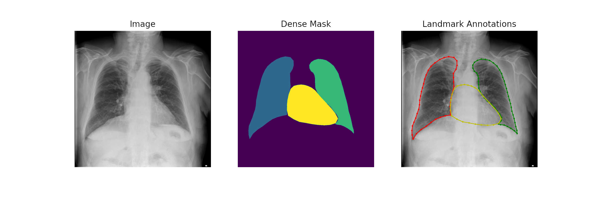

# Chest x-ray Landmark Segmentation Dataset.

This git repo contains 911 landmark annotations for chest x-ray images from JSRT, Shenzhen, Montgomery and Padchest datasets.\
The landmark annotations were obtained with an ensemble of HybridGNet 2-IGSC models, using dense segmentation masks as input.



Pre-processing scripts are provided for every dataset, please download them from their official websites. 

Lung annotations are available for images from all datasets. \
Heart annotations are only available for JSRT and Padchest images.

Annotations:\
RL : Right Lung (44 landmarks) \
LL : Left Lung (50 landmarks) \
H : Heart (26 landmarks)


If you are using the annotations, please cite our work:

Gaggion, N., Mansilla, L., Milone, D. H., & Ferrante, E. (2021, September). Hybrid graph convolutional neural networks for landmark-based anatomical segmentation. In International Conference on Medical Image Computing and Computer-Assisted Intervention (pp. 600-610). Springer, Cham.

https://link.springer.com/chapter/10.1007%2F978-3-030-87193-2_57

```
@InProceedings{10.1007/978-3-030-87193-2_57,
author="Gaggion, Nicol{\'a}s
and Mansilla, Lucas
and Milone, Diego H.
and Ferrante, Enzo",
title="Hybrid Graph Convolutional Neural Networks for Landmark-Based Anatomical Segmentation",
booktitle="Medical Image Computing and Computer Assisted Intervention -- MICCAI 2021",
year="2021",
publisher="Springer International Publishing",
address="Cham",
pages="600--610",
isbn="978-3-030-87193-2"
}
```
