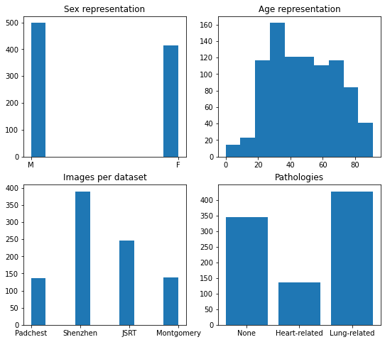

# Chest x-ray Landmark Segmentation Dataset.

This git repo contains 911 landmark annotations for chest x-ray images from JSRT, Shenzhen, Montgomery and Padchest datasets.\
The landmark annotations were obtained using an ensemble of HybridGNet 2-IGSC models, with binary segmentation masks as input.

Pre-processing scripts are provided for every dataset, please download them from their official websites. 

Lung annotations are available for images from all datasets. \
Heart annotations are only available for JSRT and Padchest images.

Annotations:\
RL : Right Lung\
LL : Left Lung\
H : Heart

If you are using the annotations, please cite our work:

https://link.springer.com/chapter/10.1007%2F978-3-030-87193-2_57